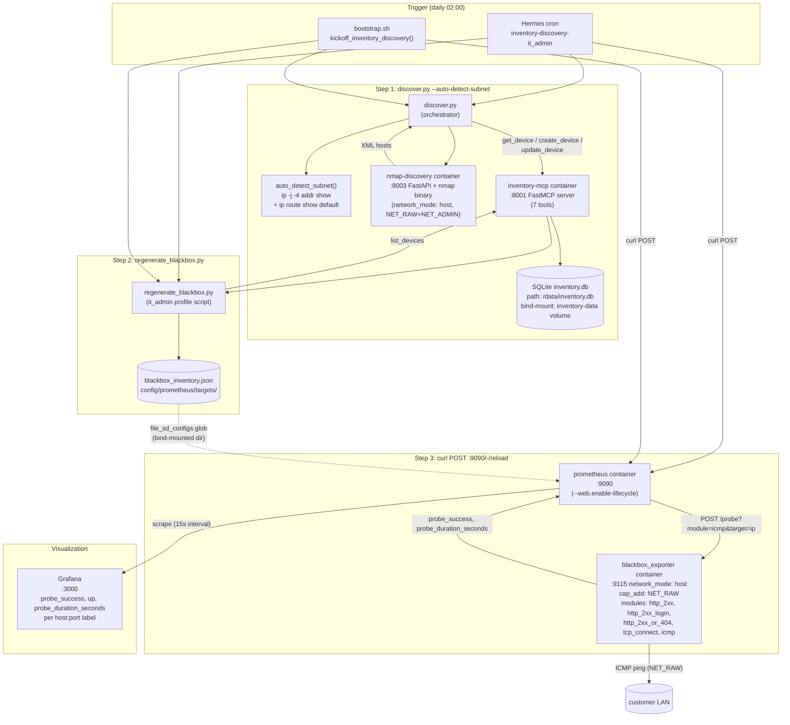
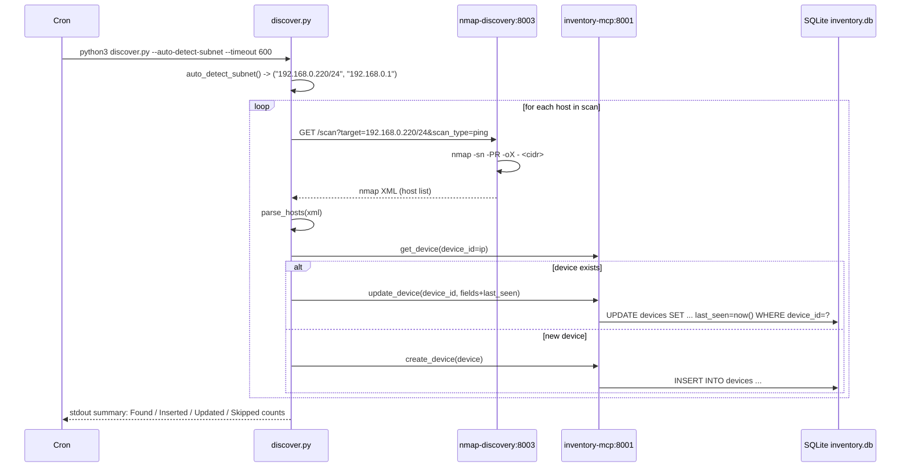
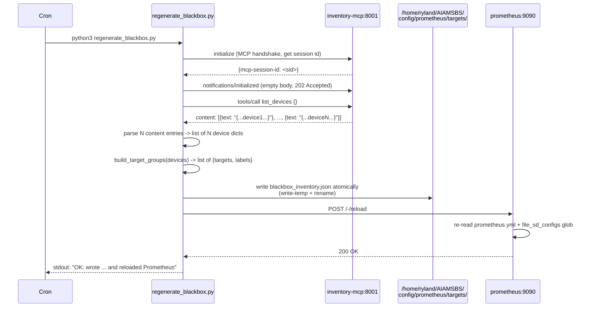
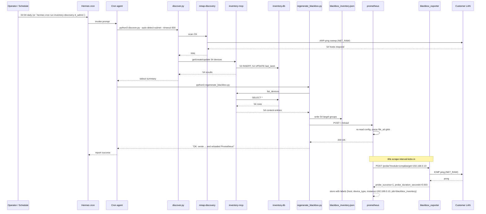

# Inventory Discovery + Blackbox-from-Inventory

**Status:** BACKLOG #39 shipped 2026-07-11 on `feature/network-discovery-phase2-20260710`. All 7 sub-items live, 4 follow-up fixes committed in the same branch. See [BACKLOG.md §39](../BACKLOG.md) for the planning doc and [§40](../BACKLOG.md) for the deferred follow-up (nmap-discovery multi-target support).

**What this delivers:** the AIAMSBS host scans its local subnet on a schedule, builds a live inventory of discovered devices, regenerates a Prometheus `file_sd_configs` target file from that inventory, and the blackbox-exporter ICMP-probes every discovered host — all in one cron tick, no manual operator intervention.

---

## High-level architecture



---

## The full process, step by step

The cron fires daily at 02:00 (`hermes cron run inventory-discovery-it_admin` for manual). The agent prompt instructs it to execute three shell steps sequentially and report the result.

### Step 1 — `discover.py --auto-detect-subnet --timeout 600`

The orchestrator script in `inventory-stack/inventory-discovery/scripts/`. The `--auto-detect-subnet` flag (sub-item 4) figures out the target subnet without manual intervention:

```bash
ip -j -4 addr show $(ip route | awk '/default/{print $5; exit}') \
  | jq -r '.[0].addr_info[0] | "\(.local)/\(.prefixlen)"'
ip route | awk '/default/{print $3; exit}'
```

That returns e.g. `192.168.0.220/24` for the AIAMSBS host. The script then calls the nmap-discovery container's FastAPI endpoint:



Two critical things the script does (sub-item 1):

1. **Get-then-branch:** for each parsed host, call `get_device(ip)` first. If the device exists, call `update_device(device_id, fields + last_seen)` (PATCH semantics — only the fields you pass get written). If new, call `create_device(device)`. Without this, a daily cron would hit the SQLite `PRIMARY KEY` collision on re-scan and silently count everything as a "skipped duplicate" — `last_seen` would never refresh.

2. **`last_seen` field:** on update, the script passes `{"last_seen": "<ISO 8601 UTC now>", "ip_address": ..., "mac_address": ..., "hostname": ..., "device_type": ..., "vendor": ..., "source": ...}` (sub-item 1's `_update_fields_from_payload` helper). On insert, the inventory-mcp's own logic sets `last_seen` to `CURRENT_TIMESTAMP`.

Typical first-run output:

```
$ python3 discover.py --auto-detect-subnet --timeout 120
Auto-detected subnet: 192.168.0.220/24, gateway: 192.168.0.1
Inventory discovery: scanning 192.168.0.220/24...

Inventory discovery complete:
  Target:   192.168.0.220/24
  Found:    54 device(s)
  Inserted: 53 new device(s)
  Updated:  1 existing device(s)
  Skipped:  0 duplicate(s)
```

Second run on the same subnet (the daily cron use case):

```
  Found:    54 device(s)
  Inserted: 0 new device(s)
  Updated:  54 existing device(s)
  Skipped:  0 duplicate(s)
```

### Step 2 — `regenerate_blackbox.py`

The script lives at `~/.hermes/profiles/it_admin/scripts/regenerate_blackbox.py` (installed from the repo's `profiles/it_admin/scripts/regenerate_blackbox.py`).



The script's contract:

| Function | Behavior |
|---|---|
| `list_inventory_devices()` | MCP handshake + `list_devices` call. **Parses one content entry per device** (not `content[0]` only — see follow-up fixes below). Returns list of device dicts. |
| `build_target_groups(devices)` | Flattens devices into Prom `file_sd_configs` shape: `[{targets: [ip], labels: {host, device_type}}, ...]`. Skips devices with no IP. |
| `write_targets_file(groups)` | Atomic write (write-temp + rename) to `TARGETS_DIR/blackbox_inventory.json`. The bind-mount is on the **directory** (not a single file), so the new file appears atomically inside the prom container — no inode-bind-mount trap. |
| `reload_prometheus()` | `POST :9090/-/reload`. The container is started with `--web.enable-lifecycle` so the reload endpoint is enabled. Only the in-memory config reloads; the container stays up. |

### Step 3 — `curl -X POST http://localhost:9090/-/reload`

Tells Prometheus to re-read its config file. The container has `--web.enable-lifecycle` enabled, so the reload endpoint is functional. The file_sd_configs glob in the active config gets re-evaluated; the `blackbox_inventory.json` is parsed; new target groups are added to the scrape pool. Existing targets are not disturbed.

### Step 4 — Prometheus starts probing

Prometheus's new `blackbox_inventory` scrape job:

```yaml
- job_name: 'blackbox_inventory'
  metrics_path: /probe
  params:
    module: [icmp]
  scrape_interval: 60s
  scrape_timeout: 10s
  file_sd_configs:
    - files: ['/etc/prometheus/targets/blackbox_inventory*.json']
  relabel_configs:
    - source_labels: [__address__]
      target_label: __param_target
    - source_labels: [__param_target]
      target_label: instance
    - target_label: __address__
      replacement: 192.168.0.220:9115
```

For each target in the file (e.g. `192.168.0.10`):

1. Prom sends `POST http://192.168.0.220:9115/probe?module=icmp&target=192.168.0.10`
2. Blackbox's `icmp` module pings the target via raw socket (uses the `cap_add: NET_RAW` we added)
3. Blackbox returns the prober metrics as HTTP response
4. Prom scrapes those metrics, attaches the file's `host` and `device_type` labels

**The blackbox-exporter is one process with multiple modules** (http_2xx, http_2xx_login, http_2xx_or_404, tcp_connect, **icmp**). The `icmp` module is new. The exporter's `config/blackbox.yml` adds:

```yaml
icmp:
  prober: icmp
  timeout: 5s
  icmp:
    preferred_ip_protocol: ip4
```

---

## File touchpoints (what's installed where)

| Path on .220 | Source | Role |
|---|---|---|
| `~/AIAMSBS/inventory-stack/inventory-discovery/scripts/discover.py` | repo (sub-item 1 + 4) | discover.py orchestrator |
| `~/AIAMSBS/inventory-stack/nmap-discovery/server.py` | repo (sub-item 3) | nmap FastAPI + the actual `nmap` binary |
| `~/AIAMSBS/inventory-stack/mcp/server.py` | repo (sub-item 2) | inventory-mcp FastMCP server (7 tools now) |
| `~/AIAMSBS/profiles/it_admin/scripts/regenerate_blackbox.py` | repo (sub-item 5) | source |
| `~/.hermes/profiles/it_admin/scripts/regenerate_blackbox.py` | installed by bootstrap | the actual script the cron runs |
| `~/AIAMSBS/config/prometheus/targets/blackbox_inventory.json` | written by `regenerate_blackbox.py` | the live target file |
| `~/AIAMSBS/config/prometheus.yml` | repo (sub-item 5) | the new `blackbox_inventory` job |
| `~/AIAMSBS/config/blackbox.yml` | repo (sub-item 5) | the new `icmp` module |
| `~/AIAMSBS/docker-compose.yml` | repo (sub-item 5 + cap_add) | prom volume bind mount + blackbox NET_RAW cap |
| `~/AIAMSBS/bootstrap.sh` | repo (sub-item 6 + 7) | cron register + end-of-install kickoff |
| `~/AIAMSBS/scripts/install_inventory_discovery_hermes_cron.py` | repo (sub-item 6) | idempotent jobs.json insert |
| `~/.hermes/cron/jobs.json` | written by `install_inventory_discovery_hermes_cron.py` | the live cron registry |
| `~/.hermes/skills/inventory-discovery/scripts/discover.py` | installed by `install_inventory_discovery_skill` | the canonical cron-time path |

---

## End-to-end invocation flow



Total cron duration on a busy /24: ~15-30 seconds. The bulk of that is the nmap scan (Step 1); Steps 2 and 3 take a couple of seconds.

---

## Manual operations

### Run the discovery on demand

```bash
# From the AIAMSBS repo, with the inventory stack up
cd ~/AIAMSBS/inventory-stack/inventory-discovery/scripts
python3 discover.py --auto-detect-subnet --timeout 300
```

Or pass an explicit CIDR:

```bash
python3 discover.py 192.168.0.0/24 --timeout 120
```

Or do a deep scan (adds port scan + OS fingerprinting — slower, on-demand only):

```bash
curl 'http://localhost:8003/scan?target=192.168.0.10&scan_type=deep'
```

### Regenerate the blackbox targets on demand

```bash
python3 ~/.hermes/profiles/it_admin/scripts/regenerate_blackbox.py
```

### Manually run the cron job

```bash
hermes cron run inventory-discovery-it_admin
```

### Re-register the cron (idempotent — safe to re-run)

```bash
python3 ~/.hermes/scripts/install_inventory_discovery_hermes_cron.py ~/.hermes it_admin
```

---

## Verification cheat sheet

After the cron runs (or any manual operation), verify each layer:

| Layer | Command | What to look for |
|---|---|---|
| Cron | `python3 -c "import json; d=json.load(open('/home/ryland/.hermes/cron/jobs.json')); j=[x for x in d['jobs'] if 'inventory' in x['name'].lower()][0]; print('last_status:', j.get('last_status'), 'last_error:', j.get('last_error'))"` | `last_status: ok` (or `success`); `last_error: None` |
| Inventory DB | `docker exec inventory-mcp python3 -c "import sqlite3; c=sqlite3.connect('/data/inventory.db'); print(c.execute('SELECT COUNT(*) FROM devices').fetchone()[0])"` | Device count > 0 (matches your LAN) |
| Targets file | `python3 -c "import json; print(len(json.load(open('/home/ryland/AIAMSBS/config/prometheus/targets/blackbox_inventory.json'))))"` | One entry per inventory device |
| Blackbox config | `docker exec blackbox_exporter blackbox_exporter --config.check --config.file=/etc/blackbox_exporter/blackbox.yml` | `Config file is ok` |
| Prom config | `docker exec prometheus promtool check config /etc/prometheus/prometheus.yml` | `SUCCESS: ... is valid prometheus config file syntax` (warning about the targets glob is expected if inventory is empty) |
| Prom active targets | `curl -s 'http://localhost:9090/api/v1/targets?job=blackbox_inventory' \| python3 -c "import json,sys; d=json.load(sys.stdin); print('count:', len(d['data']['activeTargets']))"` | Non-zero count, all `health=up` (or mixed if some hosts don't answer ICMP) |
| Probe metrics | `curl -s 'http://localhost:9090/api/v1/query?query=probe_success%7Bjob%3D%22blackbox_inventory%22%7D' \| python3 -c "import json,sys; r=json.load(sys.stdin)['data']['result']; print(f'{sum(1 for x in r if x[chr(34)+chr(118)+chr(97)+chr(108)+chr(117)+chr(101)+chr(34)][1]==chr(49))} up, {sum(1 for x in r if x[chr(34)+chr(118)+chr(97)+chr(108)+chr(117)+chr(101)+chr(34)][1]==chr(48))} down, total {len(r)}')"` | Mostly up, some down for hosts that genuinely don't answer ICMP |
| Prom targets UI | http://192.168.0.220:9090/targets?search=blackbox_inventory | Visual list, all `UP` (or mixed) |

---

## Follow-up fixes (commit history)

The implementation didn't land clean. The E2E surfaced four bugs that were fixed in the same branch — each with a one-sentence symptom and a one-paragraph fix:

| Commit | What | Symptom (before fix) | Fix |
|---|---|---|---|
| `9ae7c82` | cap_add: NET_RAW for blackbox_exporter | ICMP prober would fail with "operation not permitted" on first real device | Added `cap_add: [NET_RAW]` to the `blackbox_exporter` service in `docker-compose.yml` |
| `4d8b37e` | FastMCP 1-element-list unwrap | `JSONDecodeError` on the `notifications/initialized` empty-body response (202 Accepted) | Early-return `({}, sid)` when response body is empty |
| `fe3e5e4` | `file_sd_configs` glob typo | Glob `blackbox_inventory_*.json` (literal `_`) matched nothing; prometheus had `up{job="blackbox_inventory"}` empty | Changed to `blackbox_inventory*.json` (matches the actual file) |
| `064a00b` | Target file format | Script wrote `[[{...}]]` (nested array) — prometheus can't unmarshal a top-level array into a `struct{Targets,Labels}` | Flatten to a single array of `[{...}, {...}]` |
| `3a54076` | **N-content-entries parser** (the one the user caught) | Script's `list_inventory_devices` read `content[0]` only, so it always saw exactly 1 device regardless of inventory size | Iterate over all `content` entries, parse each `text` as JSON |

**E2E coverage lesson learned:** the parser was tested with 0 and 1 device but never with 54+. The 0/1 cases happen to produce identical "this is fine" output even when the parser is wrong. Any list-parsing code should be tested with N>>1 before declaring done.

---

## Open follow-ups (BACKLOG #40 and beyond)

| Item | Status | Notes |
|---|---|---|
| **#40: nmap-discovery multi-target** | Filed 2026-07-11 | The spec's force-include-gateway design doesn't work because nmap-discovery passes the target as a single argv element. v1 ships without force-include; gateway is found implicitly by ARP sweep when it's in the same /24. For multi-NIC/DMZ hosts where the gateway is on a different subnet, nmap-discovery needs to accept a list of targets. |
| Diagram update for `inventory-stack-architecture.excalidraw` | Deferred | The existing 56-element excalidraw is the static component view. Adding the cron + regenerate + file_sd flow as new boxes is straightforward but a non-trivial JSON edit; should be done as a separate diagram-edit pass. |
| Customer-network alert rules using `probe_success` | Future | Phase 3: alert on `probe_success{job="blackbox_inventory"} == 0` for >5m (host down) and `probe_duration_seconds > X` (latency degradation). The alert rules live in `config/prometheus/alerting/customer-network.yml`. |
| Per-device deep scans | Future | `scan_type=deep` (sub-item 3) is one-shot, manual, slow. For periodic deep scanning, would need a separate cron + a way to track "last deep scanned" per device. |
| Grafana dashboard for inventory | Future | A panel listing discovered devices with their `host`, `device_type`, `last_seen`, current `probe_success`. Data sources: the inventory DB (via inventory-mcp's `list_devices`) and Prom's `probe_success{job="blackbox_inventory"}`. |

---

## File-tree quick reference

```
~/AIAMSBS/
├── BACKLOG.md                                              ← row 39 (this work), row 40 (deferred)
├── bootstrap.sh                                            ← install_inventory_discovery_hermes_cron(), kickoff_inventory_discovery()
├── config/
│   ├── blackbox.yml                                        ← +icmp module
│   ├── prometheus.yml                                      ← +blackbox_inventory job
│   └── prometheus/targets/
│       ├── .gitkeep
│       └── blackbox_inventory.json                         ← regenerated every cron tick
├── docker-compose.yml                                      ← +NET_RAW cap on blackbox_exporter, +volume mount on prometheus
├── inventory-stack/
│   ├── discover.py                                         ← (moved to inventory-discovery/scripts/)
│   ├── inventory-discovery/scripts/
│   │   └── discover.py                                     ← (sub-item 1+4) orchestrator
│   ├── mcp/server.py                                       ← (sub-item 2) +list_devices tool
│   └── nmap-discovery/server.py                            ← (sub-item 3) +scan_type=deep
├── profiles/it_admin/scripts/
│   └── regenerate_blackbox.py                              ← (sub-item 5) it_admin script source
├── scripts/
│   └── install_inventory_discovery_hermes_cron.py          ← (sub-item 6) idempotent jobs.json insert
└── docs/
    └── inventory-discovery-and-blackbox.md                 ← this file
```

---

**Last verified:** 2026-07-11, .220 (Prometheus showing 55 active `blackbox_inventory` targets, 51 `up` / 2 `down` / 2 with probe in flight, all `last_seen` updated by the cron at 01:13:17 UTC).
