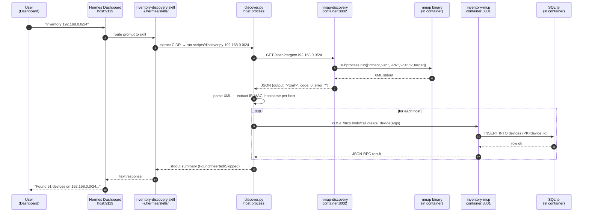

# Inventory Discovery — End-to-End Process

What happens when a customer prompts Hermes with *"inventory the subnet
192.168.0.0/24"* (or any equivalent phrasing). The full chain involves
three execution contexts (host process + two containers) and is wired
together by the inventory-discovery skill.

## Call chain



## Why each piece is where it is

| Component | Runs in | Why this location |
|---|---|---|
| `discover.py` | **Host** (`~/.hermes/skills/inventory-discovery/scripts/`) | Orchestrator — calls two services (nmap + inventory-mcp). Containerizing it would add a docker.sock dependency or a 3rd service for no benefit. |
| `nmap-discovery` | **Container** (`network_mode: host`, port 8002) | Needs `NET_RAW + NET_ADMIN` Linux capabilities for raw-socket scans. Granting those on the host is a security hole; the container scopes them to one process. |
| nmap binary | **Inside nmap-discovery container** | Same — capability isolation. nmap is invoked via `subprocess.run` from the wrapper. |
| `inventory-mcp` | **Container** (port 8001, host-bound to 127.0.0.1) | Database + MCP server co-located. SQLite is on the container's volume; the MCP transport (streamable-http) is what discover.py talks to. |
| `inventory-discovery` skill | **Host** (`~/.hermes/skills/inventory-discovery/`) | Hermes loads skills from `~/.hermes/skills/` at startup. No containerization layer exists in the skill path. |

## Ports + protocols

| Endpoint | Port (host) | Bind | Protocol | Auth |
|---|---|---|---|---|
| Hermes Dashboard | 9119 | 0.0.0.0 | HTTP | basic_auth (admin / random 20-char) |
| nmap-discovery `/scan` | 8002 | 127.0.0.1 (host-network mode) | HTTP GET | none (localhost-only) |
| inventory-mcp `/mcp` | 8001 | 127.0.0.1 | HTTP POST (JSON-RPC 2.0, streamable-http) | none (localhost-only) |

Both service endpoints are localhost-bound on purpose — they're only
called by host-side processes (Hermes skill, discover.py), not by
remote customers directly. The Dashboard is the only public-facing
surface.

## What `discover.py` does, step by step

1. **Parse args** — `<target_cidr>` positional, `--dry-run`, `--timeout`
2. **Call nmap-discovery** — `GET http://localhost:8002/scan?target=$cidr`,
   returns JSON with `output` (XML), `code`, `error`
3. **Parse XML** — `xml.etree.ElementTree.fromstring()` then walk `<host>`
   elements; for each, extract:
   - IPv4 address
   - MAC address (if `-PR` returned it via ARP)
   - Hostname (if reverse-DNS resolved)
   - OS guess (only if a `-sS/-O` scan was run — not in the default)
4. **Build `create_device` payload** per host:
   ```json
   {
     "device_id": "<ip>",
     "ip_address": "<ip>",
     "mac_address": "<mac>",
     "hostname": "<hostname>",
     "device_type": "<os_name first word>",
     "vendor": "<mac vendor>",
     "source": "nmap-discovery"
   }
   ```
5. **POST each payload** to inventory-mcp's `/mcp` `tools/call` method
6. **Classify result** — success / duplicate (PRIMARY KEY collision) /
   infra error
7. **Print summary** — Found / Inserted / Skipped / Failed counts

## Prerequisites (already set up by `bootstrap.sh`)

- ✅ nmap-discovery container running (port 8002 bound)
- ✅ inventory-mcp container running (port 8001 bound)
- ✅ inventory-mcp registered in the active Hermes profile's config
  (`register_inventory_mcp "default"` in `bootstrap.sh`)
- ✅ `inventory-discovery` skill installed at `~/.hermes/skills/inventory-discovery/`

If any of those are missing, the skill's SKILL.md tells the customer
which command to run to fix it.

## How to test it manually

```bash
# 1. Verify the wrappers respond
curl -s http://localhost:8002/scan?target=127.0.0.1 | jq '.code, .output | length'
# expect: 0, 1000+

# 2. Run discover.py in dry-run (no DB writes)
python3 ~/.hermes/skills/inventory-discovery/scripts/discover.py \
  --dry-run --timeout 60 192.168.0.0/24
# expect: "Found N device(s)" summary

# 3. Run for real (inserts into inventory DB)
python3 ~/.hermes/skills/inventory-discovery/scripts/discover.py \
  --timeout 60 192.168.0.0/24
# expect: same summary with Inserted > 0 (first run) or Skipped > 0 (re-run)

# 4. Query the DB to confirm devices are there
# (via inventory-mcp's search_devices tool or direct sqlite3 read)
```

## Known gaps (as of 2026-06-25)

| Gap | Status |
|---|---|
| MCP session handshake in discover.py — server rejects bare `tools/call` with "Missing session ID" | Tracked — needs `initialize` + `notifications/initialized` + `mcp-session-id` header |
| OS fingerprinting — current nmap command is `-sn -PR` (host discovery only); no `-sS -O` mode | Optional — host discovery is the primary use case; OS info is a stretch goal |
| nmap-discovery on a non-host-network deployment — current `network_mode: host` exposes it on every host interface | By design (matches `network_mode: host` for raw socket access); security trade-off acknowledged |

## Related docs

- `inventory-stack/inventory-discovery/SKILL.md` — the skill definition
- `inventory-stack/inventory-discovery/scripts/discover.py` — the script
- `inventory-stack/nmap-discovery/server.py` — the nmap wrapper
- `inventory-stack/mcp/server.py` — the inventory-mcp server
- `bootstrap.sh` `register_inventory_mcp()` / `start_nmap_discovery()` /
  `install_inventory_discovery_skill()` — the wiring
- `diagrams/inventory-stack-architecture.excalidraw` — earlier diagram
  showing inventory-mcp + MCP client (does not include the discover.py
  flow yet — could be extended in a follow-up)